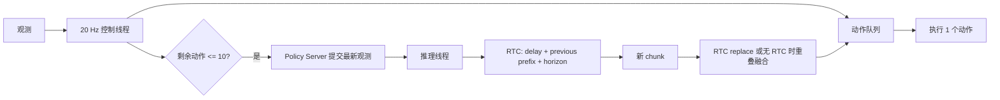

# 异步闭环推理运行时

## 为什么需要异步

20 Hz 控制周期只有 50 ms。2 步学生的 policy-only 推理延迟约 135 到 175 ms，加入动作后处理后单次策略请求仍可能跨越多个控制周期。控制线程如果同步等待模型，动作队列会出现空窗。

运行时拆成两个线程：



控制线程只做 `tick`、队列消费和安全后处理。模型计算放在 Policy Server 的单 worker 中。待处理请求最多保留一个，新观测到来时替换旧请求，避免策略落后于真实状态。

## 一次闭环 tick

1. 读取当前队列深度。
2. 深度小于等于 10，且推理线程空闲时提交当前观测。
3. 提交请求时保存旧队列前 10 个未执行动作，作为 RTC 的 `prev_chunk_left_over`。
4. 推理线程测量本次耗时。请求带有控制步编号时，传给下一次 RTC 的 `inference_delay` 是推理期间实际消费的控制步数；没有控制步编号时才退回 `ceil(耗时 × 20)` 的墙上时间估计。
5. RTC 开启时，新 chunk 返回后先丢弃推理期间已经过去的前缀，再直接替换队列。RTC 关闭时，才对旧队列和新 chunk 的前 `L=10` 步做线性融合：

   ```text
   a[i] = (1 - (i + 1) / L) * a_old[i]
          + ((i + 1) / L) * a_new[i]
   ```

   旧队列的过期尾部被丢弃，丢弃 delay 后的新 chunk 第 11 步以后直接接入队列。
6. 控制线程消费一个动作。夹爪迟滞在融合后执行，保证连续动作和夹爪状态分别处理。

## RTC 参数

真实 SmolVLA 调用使用：

```python
policy.predict_action_chunk(
    batch,
    prev_chunk_left_over=previous_prefix,
    inference_delay=measured_delay_steps,
    execution_horizon=10,
)
```

当前配置为 `RTC enabled=true`、指数 prefix schedule、guidance weight 10、execution horizon 10。RTC 负责采样过程中的前缀约束，动作队列负责控制线程和推理线程解耦，RTC 路径采用 replace 语义。关闭 RTC 的消融路径才启用 10 步 overlap blend。

## 配置护栏

`configs/libero_spatial_task0.toml` 的 `[control.rtc]` 块在 `validate_rtc_config` 中做锁定校验。
运行 rollout 前先执行 `python scripts/validate_experiment_config.py`，确认配置护栏通过。护栏拒绝以下漂移：

- `enabled` 不是布尔 true，或 `execution_horizon` 不等于 10。
- `execution_horizon` 超过 `control.chunk_size` 或 `teacher.chunk_size`，或与 `control.execute_steps`、`teacher.execute_steps` 不一致。
- `max_guidance_weight` 不是正有限数值。
- `prefix_attention_schedule` 不是 `EXP` 或 `LINEAR`。
- `inference_delay_mode` 不是 `measured_at_runtime`，`debug` 不是布尔值。

运行时把 `rtc_execution_horizon` 和 `execute_steps` 作为独立参数使用，护栏保证两者在配置层保持对齐。
rollout 命令中的 `--disable-rtc`、`--rtc-max-guidance-weight` 和 `--rtc-schedule`
属于消融覆盖项，不会改写 TOML，也不会被 TOML 护栏代替校验；使用这些选项时应把完整命令
和参数写入实验记录。该文件同时保留原有全部选项、字段和逻辑，只新增校验分支。

## 冷启动和安全边界

模型第一次 CUDA 前向包含加载和 kernel warmup，不能直接拿它作为控制线程的实时延迟。实际运行时先同步生成一个初始 chunk，再启动 20 Hz 控制循环。后续推理在线程中执行。

夹爪方向尚未完成真机和仿真确认。代码在硬件模式下拒绝 `gripper_polarity=pending`，当前 smoke 使用 `positive_open` 只代表软件链路测试。队列耗尽时运行时返回 `waiting_for_policy=true`，真机接入时应绑定保持上一安全动作或急停策略，不能把空动作当成合法控制命令。

## 固定 seed 可复现

Flow Matching 采样从随机噪声出发，固定 RNG 可以让同一运行模式和同一 episode 的结果复现。
`seed_policy_rng(seed)` 同时重置 Python `random`、NumPy 和 PyTorch（含 CUDA）RNG。
PyTorch 的默认 CPU generator 是线程局部的，主线程播种不会影响推理线程，所以
`AsyncPolicyServer(..., seed=...)` 会在 worker 线程启动时在自己的线程里重新播种。
`run_libero_rollout.py` 的 `--torch-seed` 在每个 episode 的首次策略前向处调用它，
并把同一值传给 `AsyncPolicyServer`。同步与异步使用同一个起始 seed，但 warmup、线程调度
和请求数量可能让后续随机噪声序列错位，所以不能要求两种模式逐前向使用相同噪声。
异步模式仍受控制线程时序影响，固定 seed 也不等于动作轨迹逐位相同。
`run_async_smolvla_smoke.py` 的 `--seed` 用于固定观测 smoke。

## 已完成的真实 smoke

产物：`artifacts/async_smolvla_smoke.json`。

队列和 RTC 使用归一化动作，控制线程出队后调用 LeRobot postprocessor，再交给执行端。

| 指标 | 结果 |
| --- | ---: |
| 学生模型 | 2 步 SmolVLA，task 0 |
| 初始 warmup | 498.8 ms |
| 控制 tick | 120 |
| 运行时间 | 6.42 s |
| 输出动作数 | 120 |
| waiting tick | 0 |
| 提前触发次数 | 3 |
| 推理耗时 | 154.2 ms、145.6 ms、206.0 ms |
| resulting delay（队列实际丢弃） | 4、3、5 步 |
| inference delay（传给当前请求） | 0、4、3 步 |
| 合并前队列深度 | 7、7、9 |
| 丢弃新 chunk 前缀 | 4、3、5 步 |
| deadline miss | 0 |
| 输出形状 | `[1,50,7]` |

这次 smoke 验证了异步执行和 RTC 参数传递。它重复使用同一条观测，没有进行 LIBERO 环境成功率评估。

同一运行时接入 50-step 蒸馏得到的 `student_2_action_expert.pt` 后，初始 warmup 为 495.6 ms，120 个 tick 全部产生动作，waiting tick 为 0。两次提前推理耗时为 213.8 ms 和 230.7 ms，RTC delay 为 0、5、5 步，合并前队列深度为 5、5，丢弃新 chunk 前缀为 5、5 步，deadline miss 为 0。该次 smoke 在控制线程出队后调用 LeRobot postprocessor，结果保存于 `artifacts/distillation/task0_dev50/async_smolvla_smoke.json`。该测试仍使用固定观测，不能替代 LIBERO 环境 rollout。

## 文件入口

- `src/smolvla_flow/async_runtime.py`
- `scripts/run_async_runtime_smoke.py`
- `scripts/run_async_smolvla_smoke.py`
- `tests/test_async_runtime.py`
